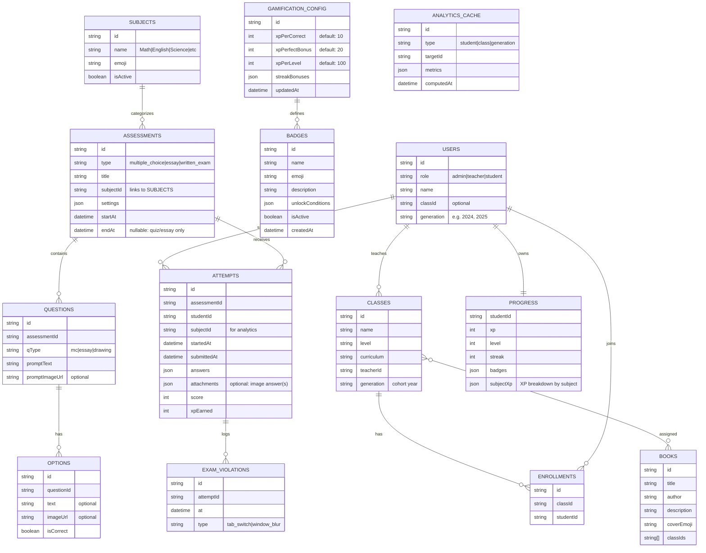

# 🎓 FunLMS Kids – Complete Feature List
---

## 🎯 Overview

**FunLMS Kids** is a gamified Learning Management System (LMS) designed for kindergarten and early elementary students. The platform uses a **Duolingo-inspired UI**, is **child-friendly**, and supports **bilingual learning (Indonesian & English)**.

The system is structured around three roles:
- **Admin** (system management)
- **Teacher** (content & class management)
- **Student** (learning & gamified experience)

---

## 🧑‍💼 Admin Features (NEW)

### Admin Dashboard (`/admin/dashboard`)
- System overview (total teachers, students, classes)
- Quick navigation to management modules

### User Management (`/admin/users`)
- ✅ Create teacher accounts
- ✅ Create student accounts
- ✅ Edit / delete users
- ✅ Assign roles (Admin / Teacher / Student)

### Class Management (`/admin/classes`)
- ✅ Create classes
- ✅ Assign **teachers** to classes
- ✅ Assign **students** to classes
- ✅ View class details:
  - Assigned teacher
  - List of students
- ✅ Reassign teachers or students between classes

### Gamification Settings (`/admin/gamification`) *(NEW)*
- ✅ **XP Configuration**:
  - Set XP per correct answer (default: 10)
  - Set XP bonus for perfect score (default: 20)
  - Set XP required per level (default: 100)
  - Configure streak bonuses (XP multipliers)
- ✅ **Badge Management**:
  - Create custom badges (name, emoji, description)
  - Define unlock conditions:
    - XP threshold (e.g., 100 XP, 500 XP)
    - Quiz completion count (e.g., 5, 10, 20 quizzes)
    - Streak milestones (e.g., 3-day, 7-day, 30-day)
    - Perfect score count
    - Subject-specific achievements
    - Level milestones
  - Enable/disable badges
  - Edit or delete existing badges
- ✅ **Subject Categories**:
  - Define subjects (Math, English, Science, etc.)
  - Assign subjects to assessments for analytics

> Admin acts as the **single source of truth** for class ownership, membership, and gamification rules.

---

## 👨‍🏫 Teacher Features

### Dashboard (`/teacher/dashboard`)
- Quick stats overview:
  - Total students
  - Total classes
  - Active learners
- Quick action buttons
- Recent activity feed

### Class Management (`/teacher/classes`)
- ✅ View assigned classes
- ✅ View student list per class
- ❌ Cannot create/delete classes (admin-only)
- ❌ Cannot assign students directly (admin-controlled)

### Analytics Dashboard (`/teacher/analytics`) *(NEW)*

#### Student Performance Analysis
- ✅ **Individual Student View**:
  - Performance breakdown by subject (Math, English, Science, etc.)
  - Strength/weakness radar chart
  - Quiz score trends over time
  - XP progression graph
  - Recommended focus areas
- ✅ **Class Overview**:
  - Average scores by subject
  - Top performers leaderboard
  - Students needing attention (low scores / declining trends)
  - Subject difficulty heatmap

#### Generational Comparison *(NEW)*
- ✅ **Generation/Cohort Analytics**:
  - Compare performance across generations (e.g., Class of 2024 vs 2025)
  - Subject-by-subject comparison charts
  - Identify generational strengths (e.g., "Gen 25 excels in English")
  - Identify generational weaknesses (e.g., "Gen 25 struggles with Math")
  - Trend analysis across multiple generations
- ✅ **Insights Dashboard**:
  - Auto-generated insights (e.g., "Generation 25 scored 15% higher in Reading than Generation 24")
  - Curriculum effectiveness indicators
  - Suggestions for teaching focus adjustments

#### Export & Reports
- ✅ Export analytics as PDF/CSV
- ✅ Scheduled report generation (weekly/monthly)
- ✅ Share reports with Admin

### Book Library (`/teacher/books`)
- ✅ Upload books (title, author, description)
- ✅ Select cover emoji
- ✅ Assign books to specific classes
- ✅ Filter books by class
- ✅ View book details
- ✅ Delete books
- ✅ Data persists in `localStorage`

### Quiz / Content Builder (`/teacher/content`)
- ✅ Create questions with selectable **assessment type**:
  - **Multiple Choice Quiz**
  - **Essay / Short Answer**
  - **Written Exam** *(exam mode)*

#### Question Types & Media
- ✅ Multiple choice questions (text)
- ✅ Multiple choice questions (image-based)
- ✅ Essay questions
- ✅ Drawing canvas questions
- ✅ **Upload image for question prompt** *(optional)*
- ✅ **Upload image for each multiple choice option** *(optional)*
  - Option supports: **text-only / image-only / text + image**

#### Quiz / Exam Settings
- ✅ Configure assessment settings:
  - AI hints enable/disable
  - AI hint limit per quiz
  - Allow skip questions
  - Allow redo questions
  - ✅ Tab lock / focus mode enable/disable *(for Written Exam)*
  - ✅ **Allow image answers (student can answer by uploading an image)** *(teacher-controlled)*
    - Applies to: **Essay / Short Answer** and **Written Exam**

#### Scheduling & Availability
- ✅ Quiz & Essay (Assessment):
  - Set start date & time
  - Set deadline (end date & time)
  - Students can only access after start time and before deadline
- ✅ Written Exam:
  - Set start date & time only
  - No deadline configuration
  - Exam behavior enforced by exam mode rules

- ✅ Preview questions before publishing

---

## 👧 Student Features

### Learning Home (`/student/learn`)
- Subject cards with progress indicators
- Daily XP goal progress
- Current streak display
- Quick access to practice activities

### Practice / Quiz (`/student/practice`)
- ✅ Supports multiple assessment modes:
  - Multiple Choice Quiz
  - Essay / Short Answer
  - Written Exam *(exam mode)*

- ✅ Multiple question types:
  - Multiple choice (text & image)
  - Multiple choice options (text & image)
  - Drawing canvas
  - Essay/short answer

- ✅ Question navigator for reviewing answers
- ✅ Skip questions (if enabled)
- ✅ AI hints (if enabled)
- ✅ Real-time feedback on answers
- ✅ Results screen with score and XP earned
- ✅ Retry option

#### Image Answer Submission (Teacher-controlled)
- ✅ If enabled by teacher, students can **answer by uploading an image**:
  - For **Essay / Short Answer** questions
  - For **Written Exam** responses
- ✅ Supports:
  - Text-only answer
  - Image-only answer
  - Text + image answer
- ✅ Image preview before submit

#### Access Control (Scheduling)
- ✅ **Quiz & Essay**:
  - Locked before start date/time
  - Locked after deadline
  - Status messages (e.g., “Starts in…”, “Deadline in…”) *(UI)*
- ✅ **Written Exam**:
  - Locked until exam start time
  - Exam mode activates automatically

#### Exam Mode Enforcement (Written Exam)
- ✅ **Tab lock / focus mode** *(when enabled)*
- ✅ Detect tab switch / window blur
- ✅ Warning on first violation *(configurable)*
- ✅ Log violations (count + timestamps)
- ✅ Optional auto-submit / end exam after X violations *(configurable)*

### Drag & Drop Activities
- ✅ Letter–picture matching
- ✅ Visual feedback (correct / incorrect)
- ✅ Progress tracking

### Book Library (`/student/books`)
- ✅ View books assigned to student’s class
- ✅ Book detail modal
- ✅ Syncs with teacher-uploaded books

### Quests / Missions (`/student/quests`)
- Daily missions with XP rewards
- Mission types:
  - Quiz
  - Video
  - Reading
  - Games
- Progress tracking per mission

### Badges (`/student/badges`)
- ✅ View unlocked badges
- ✅ View locked badges with progress
- ✅ Automatic badge unlock

### Profile (`/student/profile`)
- Avatar display & selection
- XP and level display
- Streak information
- Achievement summary

---

## 🎮 Gamification System

### 🧩 Ownership & Governance (Who sets XP & Badges?)
- ✅ **Admin** fully controls XP rules, badge definitions, and unlock conditions via `/admin/gamification`
- ✅ Admin can create, edit, delete, and configure all gamification elements
- 👨‍🏫 Teachers **view** gamification rules but cannot modify them (ensures fairness across classes)
- 👧 Students earn XP and unlock badges automatically based on Admin-defined rules

**Why Admin-controlled?**
- Prevents XP inflation between classes
- Keeps progress consistent and predictable
- Makes analytics and generational comparisons reliable
- Allows curriculum-aligned badge customization

**Admin Gamification Capabilities:**
| Setting | Admin Can... |
|---------|-------------|
| XP per correct answer | Set any value (default: 10) |
| Perfect score bonus | Set any value (default: 20) |
| XP per level | Set threshold (default: 100) |
| Streak multipliers | Configure bonus XP for streaks |
| Badge creation | Create unlimited custom badges |
| Badge conditions | Define any unlock criteria |
| Badge status | Enable/disable badges |

**Recommended place in code:**
- `/src/config/gamification.js` → Admin-editable XP rules + badge definitions (stored in DB/localStorage)
- `/src/lib/assessmentEngine.js` → scoring, awarding XP, unlocking badges (reads from config)
- `/src/app/admin/gamification/` → Admin UI for managing gamification

### XP (Experience Points)
- ✅ XP per correct answer *(Admin-configurable, default: 10)*
- ✅ XP bonus for perfect score *(Admin-configurable, default: 20)*
- ✅ XP earn animation
- ✅ Persistent storage
- ✅ Subject-tagged XP (for analytics)

### Leveling System
- ✅ Level up threshold *(Admin-configurable, default: 100 XP)*
- ✅ Level progress bar
- ✅ Level-up animation

### Badges *(Admin-Managed)*
**Default badges** (Admin can modify/delete):
- 📚 Great Reader – 5 quizzes completed
- 🔢 Math Star – 100 XP in Math
- 🔬 Young Scientist – 100 XP in Science
- 🔥 3-Day Streak
- 🔥 7-Day Streak
- 💯 Perfect Score
- ⭐ Level 5
- 🌟 Level 10

**Admin can create custom badges with conditions:**
- XP thresholds (total or per subject)
- Quiz/assessment completion count
- Streak milestones
- Perfect score count
- Subject mastery (e.g., 90%+ average in Math)
- Level milestones
- Custom combinations

### Streaks
- ✅ Daily login tracking
- ✅ Streak counter
- ✅ Streak-based badges
- ✅ Streak bonus XP *(Admin-configurable)*

---

## 🌐 Internationalization (i18n)

- ✅ Indonesian (ID) & English (EN)
- ✅ Language toggle on all pages
- ✅ All UI text translated

---

## 💾 Data Persistence

### localStorage Integration
- ✅ Classes saved/loaded automatically
- ✅ Books saved/loaded automatically
- ✅ Student progress (XP, badges, streak) saved
- ✅ Quiz completion history saved
- ✅ Exam attempts & violation logs saved

### Storage Utility (`/src/lib/storage.js`)
- Generic storage helper
- CRUD operations for:
  - Classes
  - Users (Admin-created)
  - Books
  - Quizzes / Assessments
  - Attempts (quiz/exam submissions)
- Progress tracking with XP, levels, badges, streak

### Suggested Data Keys (localStorage)
- `funlms_users`
- `funlms_classes`
- `funlms_enrollments`
- `funlms_books`
- `funlms_subjects` *(NEW)*
- `funlms_assessments`
- `funlms_attempts`
- `funlms_progress`
- `funlms_gamification_config` *(NEW)* - Admin-editable XP settings
- `funlms_badges` *(NEW)* - Admin-defined badges
- `funlms_analytics_cache` *(NEW)* - Cached analytics data

## 🔐 Authentication

### Production Phase 1 (Simple Auth)
- **Simple login** (username/password or PIN demo) for early production rollout
- Role-based access:
  - Admin
  - Teacher
  - Student
- Session maintained via React Context
- Protected routes via role guards on `/admin/*`, `/teacher/*`, `/student/*`

### Production Phase 2 (Supabase Auth – Future)
- Migrate authentication to **Supabase Auth** (email/password or OAuth)
- Optional additions:
  - School/organization multi-tenant support
  - Row Level Security (RLS)
  - Audit logs (exam access, violations, submissions)

---

## 🎨 UI / UX

- Duolingo-inspired design
- Child-friendly colors & emojis
- Responsive layout
- CSS Modules
- Smooth animations & transitions
- Loading states & spinners

---

## 🧱 Basecode (Next.js 16 – App Router)

### Framework & Approach
- **Framework**: Next.js 16 (App Router)
- **UI**: Client-side rendering (CSR) for demo mode
- **State**: React Context (`AuthContext`, `GameContext`, `LanguageContext`)
- **Storage**: `localStorage` via `/src/lib/storage.js`

### Suggested Core Modules
- `/src/lib/storage.js` → CRUD + persistence
- `/src/lib/i18n.js` → translations + helpers
- `/src/lib/assessmentEngine.js` *(recommended)* → scoring, XP awarding, badge unlock, exam rules
- `/src/config/gamification.js` *(recommended)* → XP rules, badge definitions

### Recommended Route Guards (Role-based)
- Admin routes: `/admin/*`
- Teacher routes: `/teacher/*`
- Student routes: `/student/*`
- Guard logic via `AuthContext` and `redirect()` in layout/page components.

---

## 🔁 System Flowchart (High-Level)

```mermaid
flowchart TD
  A[Login / Role Select] --> B{Role?}

  B -->|Admin| C[Admin Dashboard]
  C --> C1[Create/Manage Teachers]
  C --> C2[Create/Manage Students]
  C --> C3[Create/Manage Classes]
  C3 --> C4[Assign Teacher to Class]
  C3 --> C5[Assign Students to Class]
  C --> S[(localStorage / storage.js)]

  B -->|Teacher| D[Teacher Dashboard]
  D --> D1[View Assigned Classes]
  D --> D2[Book Library: Upload & Assign]
  D --> D3[Assessment Builder]
  D3 --> D31[Choose Type: MC / Essay / Written Exam]
  D3 --> D32[Build Questions + Images]
  D3 --> D33[Set Settings: AI hints / skip / redo]
  D3 --> D34[Schedule: start+deadline (quiz/essay)]
  D3 --> D35[Schedule: start-only (exam)]
  D --> S

  B -->|Student| E[Student Learn Home]
  E --> E1[Practice / Assessments]
  E1 --> E2[Attempt Quiz/Essay]
  E1 --> E3[Attempt Written Exam (Exam Mode)]
  E3 --> E31[Tab Lock + Violation Log]
  E2 --> E4[Submit]
  E3 --> E4
  E4 --> F[Scoring + XP + Badge Engine]
  F --> G[Progress Update (XP/Level/Streak/Badges)]
  G --> H[Results Screen]
  H --> S
```

---

## 🗄️ Database Flowchart (Current localStorage + Future Backend-ready)



---

## 📁 Project Structure

```
src/
├── app/
│   ├── login/
│   ├── admin/
│   │   ├── dashboard/
│   │   ├── users/
│   │   ├── classes/
│   │   ├── gamification/        *(NEW)* - XP & Badge management
│   │   │   ├── xp-settings/
│   │   │   ├── badges/
│   │   │   └── subjects/
│   │   └── analytics/           *(NEW)* - System-wide analytics
│   ├── student/
│   │   ├── learn/
│   │   ├── practice/
│   │   ├── books/
│   │   ├── quests/
│   │   ├── badges/
│   │   └── profile/
│   └── teacher/
│       ├── dashboard/
│       ├── classes/
│       ├── books/
│       ├── content/
│       └── analytics/           *(NEW)* - Teacher analytics
│           ├── students/        - Individual student performance
│           ├── classes/         - Class overview & comparisons
│           └── generations/     - Generational comparisons
├── components/
│   ├── DrawingCanvas.js
│   └── charts/                  *(NEW)* - Analytics visualizations
│       ├── RadarChart.js
│       ├── TrendChart.js
│       ├── ComparisonChart.js
│       └── Heatmap.js
├── contexts/
│   ├── AuthContext.js
│   ├── GameContext.js
│   └── LanguageContext.js
├── config/
│   └── gamification.js          *(NEW)* - Admin-editable config
├── data/
│   └── mockData.js
└── lib/
    ├── i18n.js
    ├── storage.js
    └── analyticsEngine.js       *(NEW)* - Analytics calculations
```

---

## 🚀 Deployment

- **Platform**: Vercel
- **Framework**: Next.js 14 (App Router)
- **Rendering**: Static export + client-side rendering

---

## 📌 Future Enhancements (Not Yet Implemented)

- [ ] Quiz assignment per class
- [ ] Real backend database (Firebase / Supabase)
- [ ] Real authentication (OAuth / Email)
- [ ] Video learning player
- [ ] Interactive mini-games
- [ ] Parent portal
- [ ] AI-powered learning recommendations based on analytics
- [ ] Predictive analytics for at-risk students

